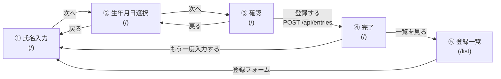
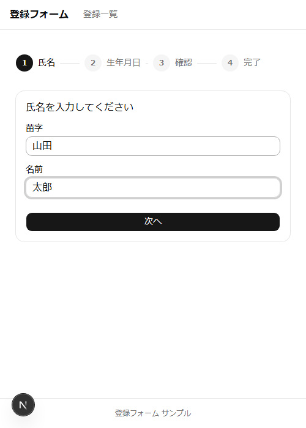
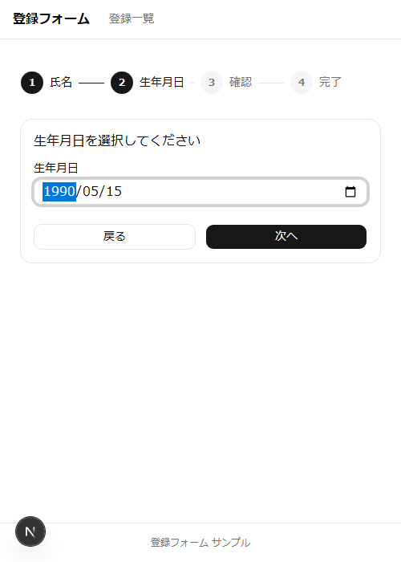
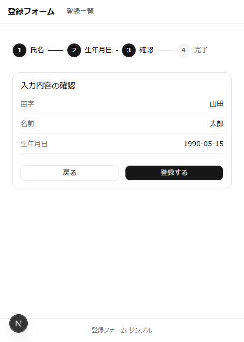
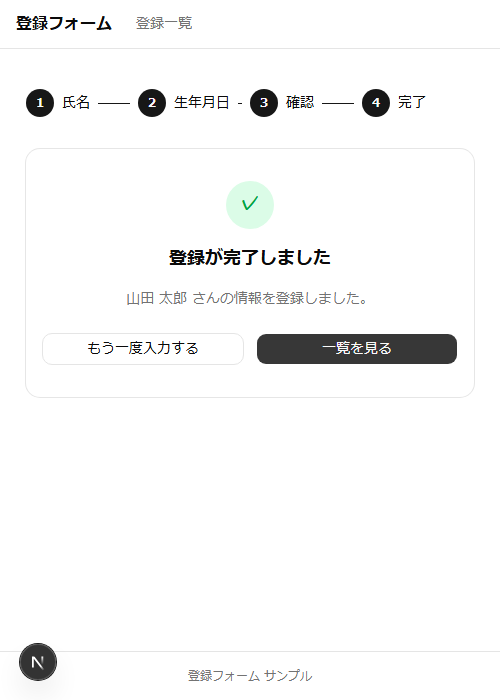
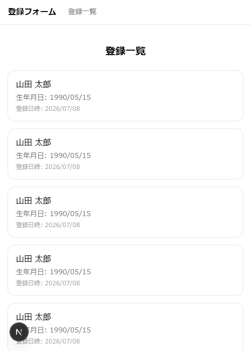

# 画面遷移図

## 遷移フロー

- ①〜④は同一ページ(`/`)内で[Wizard.tsx](src/components/Wizard.tsx)が`useState`のステップ管理だけで切り替えており、ページ遷移(リロード)は発生しない。
- ④→⑤、ヘッダーのナビ(「登録フォーム」「登録一覧」)は`next/link`によるクライアントサイド遷移で、こちらもフルリロードなし。
- ③→④のタイミングでのみ、`fetch`によるバックエンドとの通信(DBへの登録)が発生する。

## 各画面

### ① 氏名入力

苗字・名前を入力する画面。[NameStep.tsx](src/components/wizard/NameStep.tsx)

### ② 生年月日選択

生年月日を選択する画面。[BirthDateStep.tsx](src/components/wizard/BirthDateStep.tsx)

### ③ 確認

入力内容を確認し、「登録する」で送信する画面。[ConfirmStep.tsx](src/components/wizard/ConfirmStep.tsx)

### ④ 完了

登録完了後の画面。「一覧を見る」で登録一覧へ、「もう一度入力する」で①に戻る。[CompleteStep.tsx](src/components/wizard/CompleteStep.tsx)

### ⑤ 登録一覧

DBに登録済みの全データをカード形式で一覧表示する画面。[list/page.tsx](src/app/list/page.tsx)

